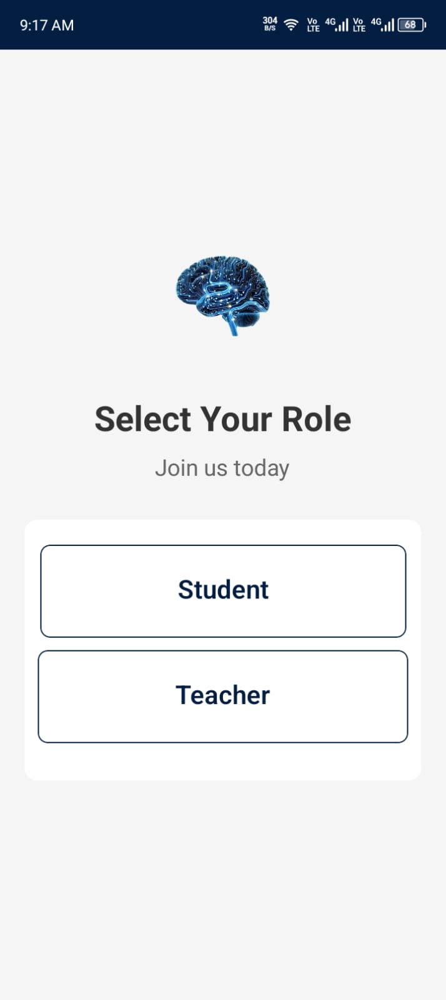
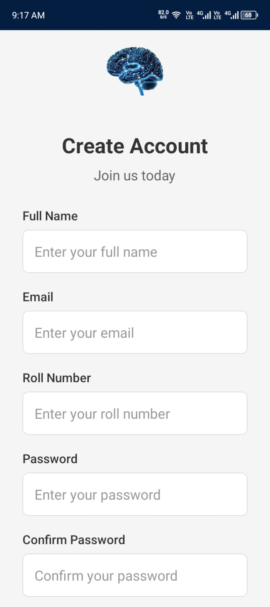
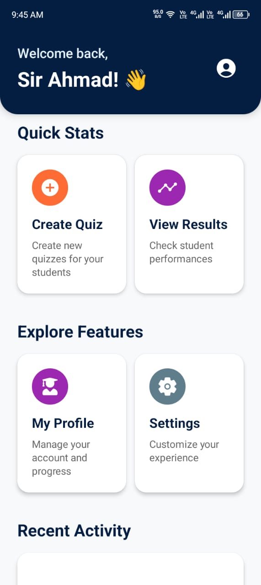
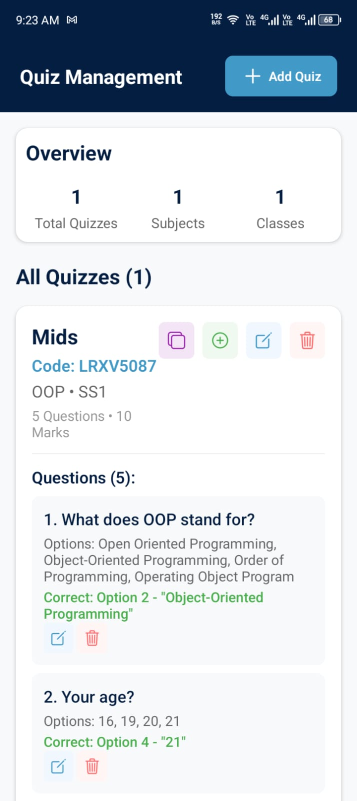
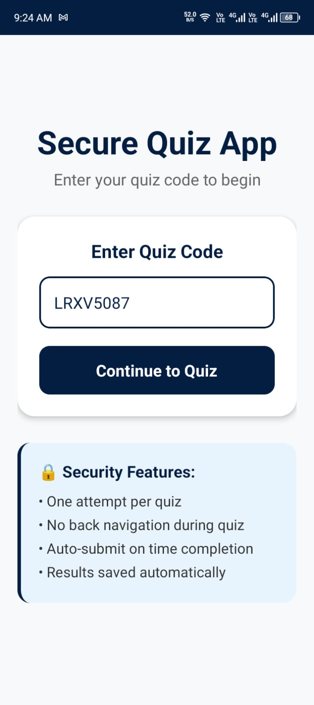
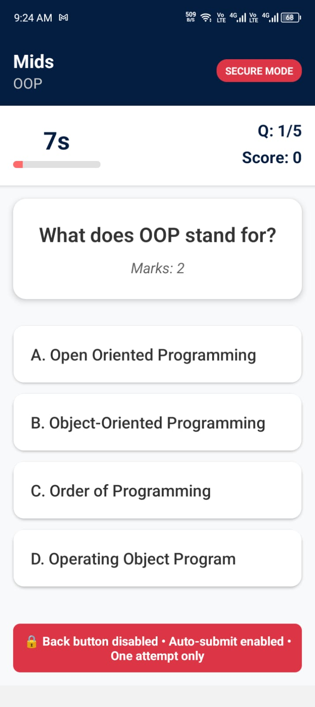
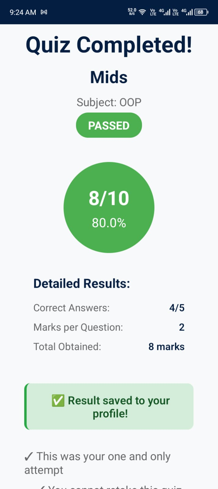
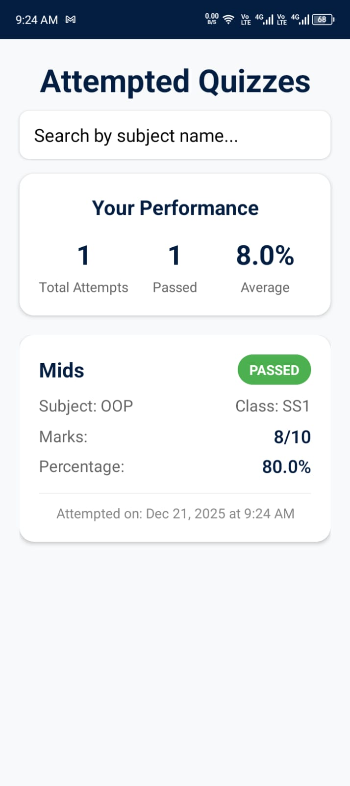
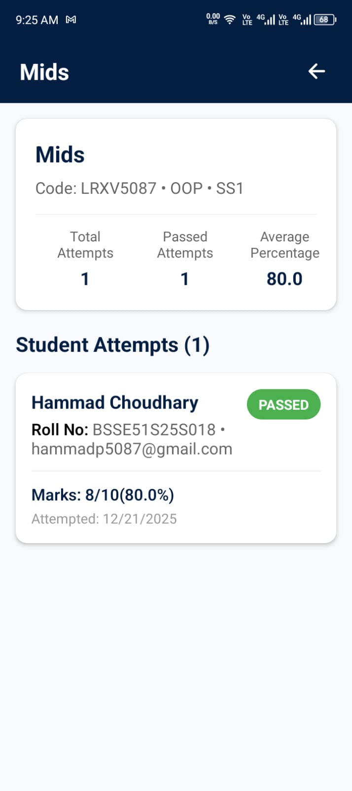
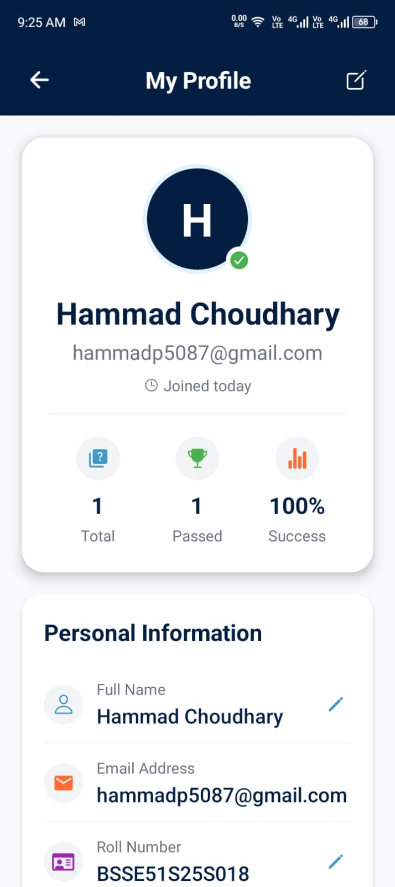

# 📱 IntelliQuiz App – Smart Classroom Quiz System

IntelliQuiz App is a role-based mobile quiz application built for digital classroom assessments. It allows teachers to create quizzes and students to join and attempt quizzes securely using a unique quiz code.

---

## 🚀 Features

### 👩‍🏫 Teacher

* Login / Signup as Teacher
* Create quizzes
* Generate unique quiz codes
* View class-wise quiz results
* Track individual student performance
* Maintain complete quiz history

### 👨‍🎓 Student

* Login / Signup as Student
* Join quiz using quiz code
* Back navigation disabled during quiz
* Instant result after quiz submission
* View past quiz history

---

## 🛠 Tech Stack

### Frontend

* React Native
* TypeScript

### Backend

* Node.js
* Express.js

### Database

* MongoDB

---

## 🔐 Authentication & Security

* Role-based authentication (Teacher / Student)
* Secure quiz access via unique quiz codes
* Navigation restriction during active quizzes

---
<!-- 
## 📸 App Screenshots

> Below are screenshots of the IntelliQuiz App showcasing different features.

### 🔹 Authentication

### 🔹 Teacher Flow

### 🔹 Student Flow

### 🔹 History & Records

--- -->
## 📸 App Screenshots

  
  

### 👩‍🏫 Teacher Flow

  
  
  
  

### 👨‍🎓 Student Flow

  
  
  
  

### 📊 History & Records

  
  

## 🎯 Project Purpose

The purpose of IntelliQuiz App is to provide a secure, fair, and efficient quiz system for classrooms, allowing teachers to manage assessments and students to track their performance.

---

## 👨‍💻 Author

**Hammad Chaudhary**
Frontend: React Native (TypeScript)
Backend: Node.js, Express.js, MongoDB

---
